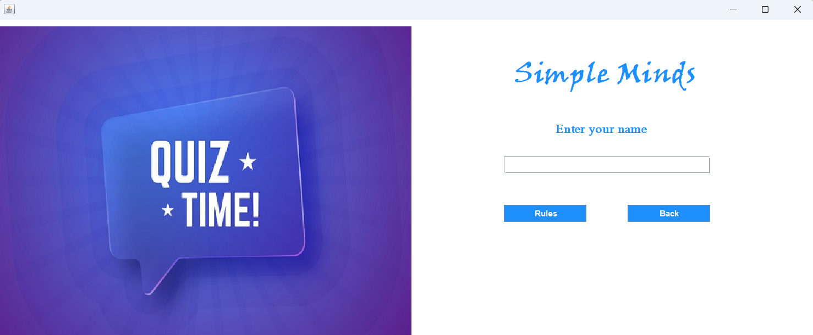
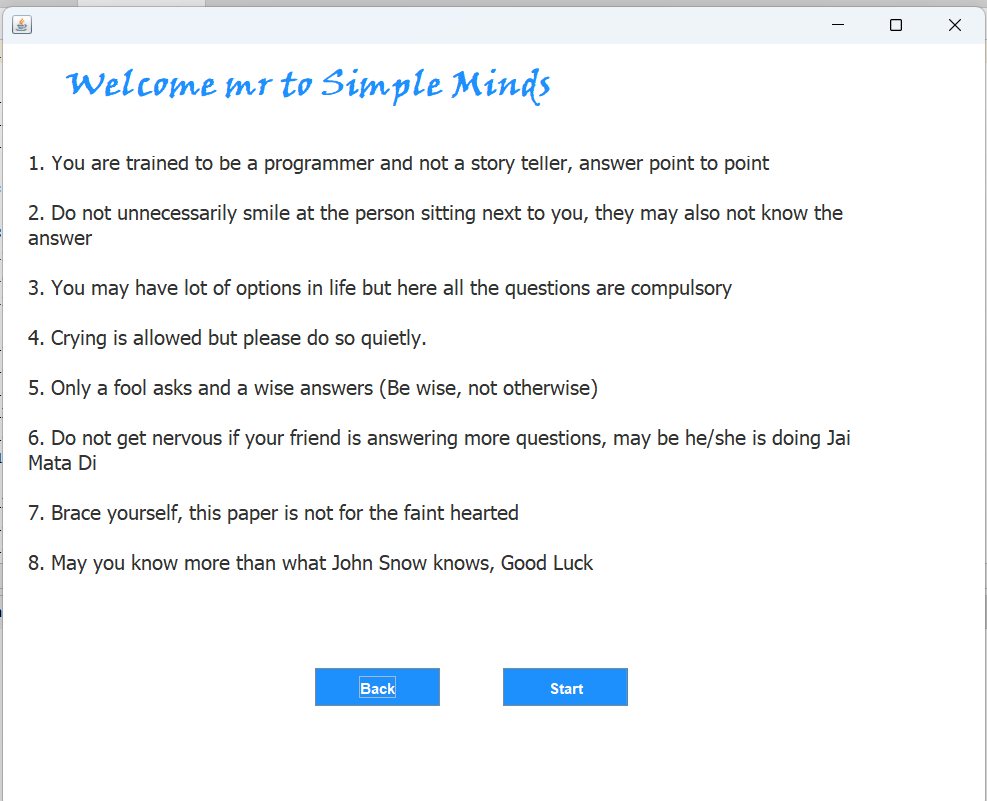
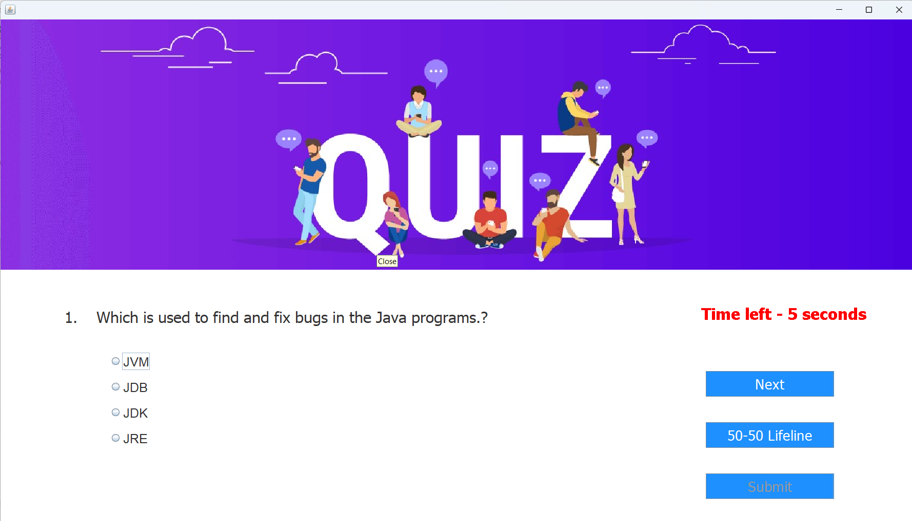

# 🧠 Java Quiz App

A desktop-based Quiz Application built using **Core Java (Swing & AWT)** that allows users to log in, view quiz rules, answer multiple-choice questions, and see their score at the end.

---

## 🚀 Features

- 🪪 **Login Window** for user entry
- 📜 **Rules Window** explaining quiz instructions
- ❓ **Quiz Window** with multiple-choice questions and timer
- 📊 **Result Window** showing final score
- 📦 Object-oriented code structure
- 🎨 GUI developed using **Java Swing & AWT**

---

## 📸 Screenshots

### 🔐 Login Window

### 📜 Rules Window

### ❓ Quiz Window

### 📊 Result Window

---

## 🛠️ Technologies Used

- **Java SE (Core Java)**
- **Java AWT & Swing**
- Event Handling
- Object-Oriented Programming (OOP)

---

## 🧩 Project Structure

